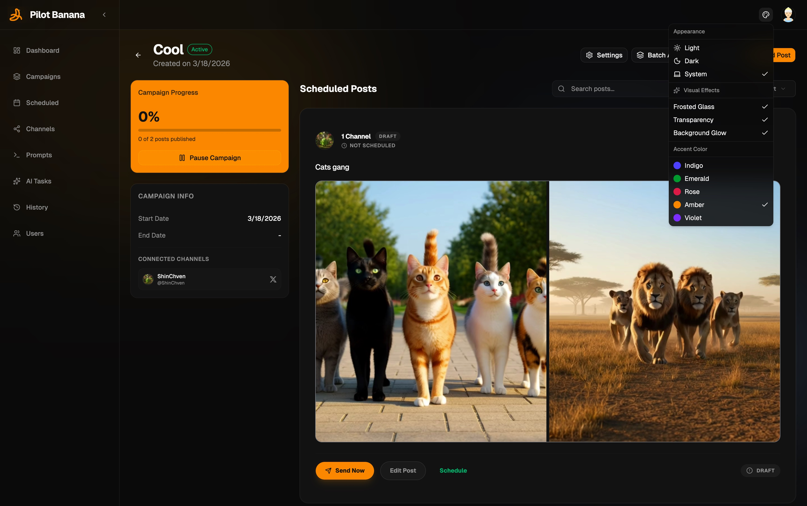

# Pilot Banana 🍌

Social media automation.

[](https://opensource.org/licenses/MIT)
[]()

Pilot Banana is a multi-tenant social media automation platform with **Generative AI** integration, designed for high-performance, set-and-forget content delivery. It provides robust data isolation for multiple users, allowing each to connect their own social media accounts as **channels**, **batch create** and **schedule posts**, and organize projects into **campaigns** for seamless cross-platform delivery. Leveraging integrated AI, Pilot Banana automatically generates context-aware text for your media files. Utilizing serverless **Azure Functions**, the platform scales with ease, empowering creators and brands to grow their presence without the manual grind.



## Why Pilot Banana? 🚀

- 📦 **Batch Efficiency:** Save hours by utilizing powerful **batch generation** and **scheduling** tools to manage hundreds of posts simultaneously.
- 🚀 **Orchestrated Campaigns:** Move beyond single posts. Design multi-phase, **cross-platform** campaigns that run themselves while you focus on the big picture.
- 🔒 **Modern Security:** Say goodbye to forgotten passwords. Pilot Banana features native **Passkey** support for seamless, biometric-grade security.
- ☁️ **Cloud-Native Scale:** Built with Azure Functions, Cosmos DB, and Blob Storage to ensure your automation scales from a single account to thousands without breaking a sweat.
- 🎨 **Next-Gen Frontend:** A lightning-fast dashboard built with **React 19**, **Tailwind CSS 4**, and **Framer Motion** for a premium, "app-like" experience.
- 🤖 **AI Content:** Leverage Google's Gemini AI to generate high-quality, context-aware posts from simple prompts or complex campaign strategies.

---

## Technical Architecture

Pilot Banana follows a clean, decoupled architecture designed for maintainability and cloud scalability.

| Component | Responsibility | Tech Stack |
|:---|:---|:---|
| **Pilot.Console** | Modern Dashboard & Management UI | React 19, Tailwind 4, Vite |
| **Pilot.Api** | Secure Entry Point & Business Logic | Azure Functions (HTTP) |
| **Pilot.Orchestration** | Background Processing & Scheduling | Azure Functions (Queue/Timer) |
| **Pilot.Core** | Domain Models & Shared Logic | .NET 9 |
| **Pilot.Infrastructure** | Persistence, AI & Cloud Services | Cosmos DB, Gemini AI, Key Vault |
| **Pilot.Adapters** | Platform-Specific Delivery (X/Twitter) | HttpClient + OAuth 2.0 PKCE |

---

## Run locally 🛠️

The project can run locally as a self-contained demo with:

- Cosmos DB Emulator for database
- Azurite for Blob, Queue, and Table storage
- `Pilot.Api` on port `7071`
- `Pilot.Orchestration` on port `7072`
- `Pilot.Console` on port `5173`

### Local demo setup

#### 1. Start local dependencies

```bash
docker compose up -d
```

This starts:
- Cosmos DB Emulator at `https://localhost:8081`
- Cosmos Data Explorer at `http://localhost:1234`
- Azurite Blob at `http://127.0.0.1:10000`
- Azurite Queue at `http://127.0.0.1:10001`
- Azurite Table at `http://127.0.0.1:10002`

#### 2. Create local settings files

Create these files if they do not already exist (you can copy from the `.example` files):
- `src/Pilot.Api/local.settings.json`
- `src/Pilot.Orchestration/local.settings.json`

Ensure the following keys are configured for local use:

```json
"Cosmos__Endpoint": "https://localhost:8081",
"Cosmos__Key": "C2y6yDjf5/R+ob0N8A7Cgv30VRDJIWEHLM+4QDU5DE2nQ9nDuVTqobD4b8mGGyPMbIZnqyMsEcaGQy67XIw/Jw==",
"Cosmos__DatabaseId": "pilot-banana",
"Blob__ConnectionString": "UseDevelopmentStorage=true",
"Auth__Jwt__Secret": "your-256-bit-secret-at-least-32-chars-long",
"GEMINI_API_KEY": "YOUR_GEMINI_API_KEY"
```

- **Note:** The `Cosmos__Key` is the standard local Cosmos Emulator key. `GEMINI_API_KEY` is required for AI post generation.

#### 3. Initialize the Cosmos database and containers

Run:
```bash
dotnet run --project scripts/InitCosmos/InitCosmos.csproj
```

This bootstrap script creates:
- Database `pilot-banana` and all required containers.
- A demo admin user (default: `admin@example.com` / `ChangeMe123!`).
- A set of default system prompts.
- Sample post history for the dashboard demo.

You can override the admin credentials:
```bash
SEED_EMAIL="demo@example.com" SEED_PASSWORD="BetterPassword123!" dotnet run --project scripts/InitCosmos/InitCosmos.csproj
```

#### 4. Restore and build the .NET solution

From the repo root:
```bash
./build.sh
```

#### 5. Start the API function app

In one terminal:
```bash
cd src/Pilot.Api
func start --port 7071
```

#### 6. Start the orchestration function app

In a second terminal:
```bash
cd src/Pilot.Orchestration
func start --port 7072
```

#### 7. Install and start the frontend

In a third terminal:
```bash
cd src/Pilot.Console
npm install
npm run dev
```

The dashboard will be available at: **`http://localhost:5173`**

### 💡 Developer Tips

- **Local Secret Storage:** When `KeyVault__VaultUri` is empty (default for local dev), secrets (like platform OAuth tokens) are stored as text files in your local application data folder:
  - **macOS**: `~/Library/Application Support/PilotBanana/Secrets`
  - **Windows**: `%AppData%\Local\PilotBanana\Secrets`
- **Idempotent Seed:** The `InitCosmos` script is idempotent for normal local use: if the `users` container already has data, the script will skip the seeding process.

> [!WARNING]
> **Demo-only local configuration:** The local setup is optimized for speed and uses shared emulator credentials. Do not use this configuration as-is in Azure or any shared environment. For cloud deployments, use **Azure Key Vault** and **Managed Identities**.

---

## X (Twitter) Configuration Guide 🐦

Pilot Banana uses **OAuth 2.0 with PKCE** for interacting with the X (formerly Twitter) API.

1. **Set up your App** in the [X Developer Platform](https://console.x.com).
2. **User Authentication Settings:**
   - **App Permissions:** Set to `Read and Write`.
   - **Type of App:** Select `Web App, Automated App or Bot`.
   - **Callback URI:** `http://localhost:7071/api/channels/callback/x`.
   - **Website URL:** Your local or production URL.
3. **Generate Credentials:** Find your **Client ID** and **Client Secret** under the "Keys and Tokens" tab.
4. **Configure Settings:** Add `XOAuth__ClientId` and `XOAuth__ClientSecret` to your `local.settings.json`.

> [!NOTE]
> **2026 Tiered Access:** Ensure your account has at least the **Free** tier (write-only) or **Basic** tier (read/write) enabled. Some features may require a minimum credit balance on the X Developer Platform.

## License

Pilot Banana is licensed under the [MIT License](LICENSE).
